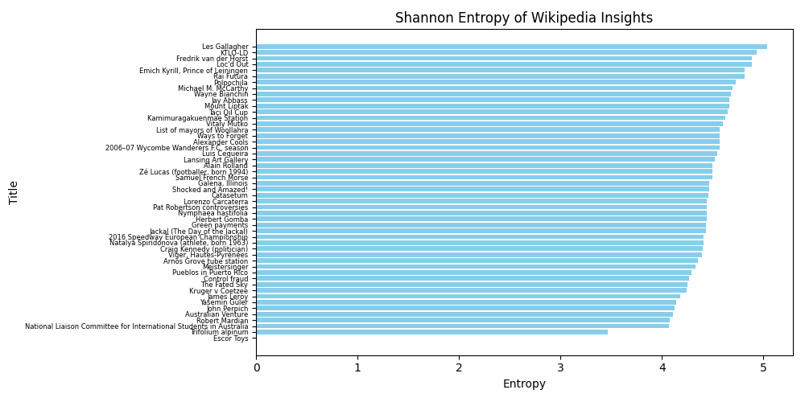
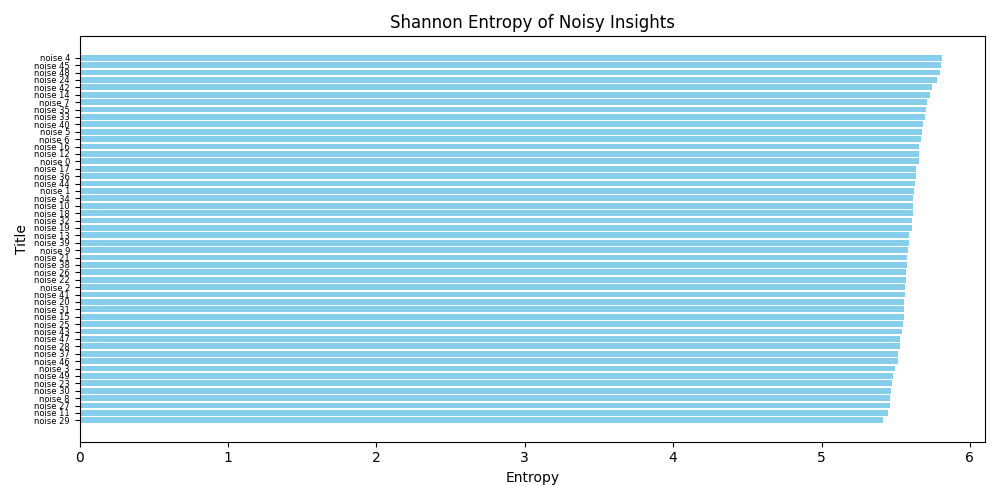
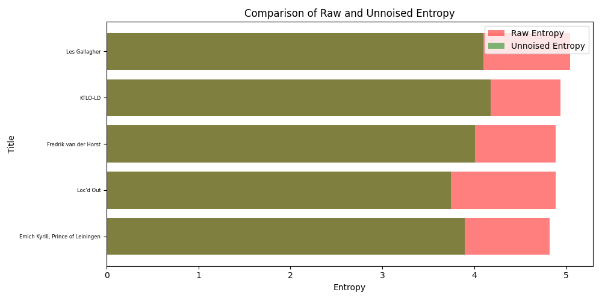

# Shannon noise reduction

Shannon noise reduction is a technique used to reduce the amount of noise in a signal by applying principles derived from Shannon entropy. Shannon entropy, named after Claude Shannon, is a measure of the uncertainty or randomness in a set of data. It is a fundamental concept in information theory and is used to quantify the amount of information in a message.

## Overview

The goal of Shannon noise reduction is to improve the quality of a signal by minimizing the noise while preserving the important information. This is achieved by analyzing the entropy of the signal and applying algorithms to filter out the noise.

## Key Concepts


- **Entropy**: A measure of the unpredictability or randomness in a data set. Higher entropy indicates more randomness, while lower entropy indicates more predictability.
- **Noise**: Unwanted or irrelevant data that can obscure or distort the important information in a signal.
- **Signal**: The important information that needs to be preserved and transmitted.

## Demonstration

I've made little demonstration application for Shanon noise reduction.
First we get some random wiki articles to have some sample data. From them we are getting title and page content. However for our usage we will use smaller parts of page content called "insights". Then we calculate entropy for desired insight.
We calculate entropy by following formula:  
<p style = 'text-align:center'>
$${H = -\sum_i p_i log_2(p_i),}$$  
</p>

where ${p_i}$ is the probability of occurrence of the i-th possible value of the source symbol.

From 50 random insights from wiki, we get following result:
<div style="max-width: 600px; margin-right: auto; margin-left: auto;" align="center">

</div>

*You can see all scraped data in ``shannon_entropy_results.txt`` file*

We can see that last insight has almost 0 entropy and that's actually because scraped data called "Escor Toys" looks following:
````
Title: Escor Toys
Insight: S
Entropy: -0.0
````
So entropy is calculated correct! Data is very predictable - only one letter, which is obvious that will contain almost no informations! It probably happened because of scraper issue, because [this wiki is not empty!](https://en.wikipedia.org/wiki/Escor_Toys)
Then we can pretty easy remove useless data. But what with data that has high entropy level?

The highest entropy data is following data:
````
Title: Les Gallagher
Insight: Alexander Leslie Gallagher (10 July 1904 – 25 August 1973) was an Australian rules footballer who played with St Kilda and Richmond in the Victorian Football League (VFL).


== Family ==
The son of John Gallagher (1850-1935), and Georgina Barbara Gallagher (1862-1933), née Ridgewell, Alexander Leslie Gallagher was born at Warragul on 10 July 1904.
He married Edna Lillian Turland (1910-1971) in 1936.
He had 4 Children with Edna, John Leslie (born 31/10/1937 - 28/02/2022), Keith, Bruce and Ruth. 
His cousin, Norman Henry John "Harry" Weidner (1907-1962), also played VFL football for Richmond
Entropy: 5.0382311231622
````
[wiki link](https://en.wikipedia.org/wiki/Les_Gallagher)

Data with lowest, but greater than 0 entropy is following:
*I selected data with insight that is representive, not "obvious one" - f.e. smaller insight means less data*

````
Title: Kruger v Coetzee
Insight: Kruger v Coetzee is an important case in South African law, in particular in the law of delict and on the question of negligence.
In an action for damages alleged to have been caused by the defendant's negligence, culpa arises, for the purposes of liability, only if a diligens paterfamilias in the position of the defendant not only would have foreseen the reasonable possibility of his conduct injuring another in his person or property and causing him patrimonial loss, but would also have taken reasonable steps to guard against such an occurrence, and if the defendant failed to take such steps.
Whether a diligens paterfamilias in the position of the person concerned would take any guarding steps at all, and, if so, what steps would be reasonable, must always depend upon the particular circumstances of each case.
Where the defendant has foreseen the possibility and taken certain steps, the onus is on the plaintiff to prove that there were further steps which he could and should have taken.
The decision in the Eastern Cape Division, in Coetzee v Kruger, was by this reasoning reversed
Entropy: 4.245421417483296
````
[wiki link](https://en.wikipedia.org/wiki/Kruger_v_Coetzee)

**Why law article has less entropy level than biographical?**
<div style="display: flex; justify-content: center; max-width: 400px; margin-right: auto; margin-left: auto; margin-bottom:20px;" align="center">
    
    
</div>

There are many reasons, which will make sense, we just need to think about them. Most of high entropy level insights contain some data represented in numbers. It's clear that they have huge impact on entropy level - probability of numbers are in general not as high as letters. Also in general there will be higher values of total characters, which also will end up in decreasing probability of character ${p_i}$ from formula to calculate entropy. Let's also notice that probability is a value from range ${\langle0;1\rangle}$.
Let's take a deep look at single sum element, "sum element of entropy" which looks like that:
<p style='text-align:center'>$${p_ilog_2(p_i),}$$</p>

in point ${p_i \sim 0,3678}$ sum of element is the lowest (so for our end sum it will count the most, because of minus sign) and is equal to ${\sim -0,52}$.
<div style="max-width: 400px; margin-right: auto; margin-left: auto;" align="center">

</div>

It means that to get most valuable data in point of view entropy, so with highest entropy we need to try to obtain 0,3678 probability for each character. It means we need to distribute characters equally.
If there is no obvious pattern it also helps to get higher entropy.
More diverse data means higher entropy - it is clear from graph above that turning point of sum element is closer to 0 than to 1. So in general it is preffered to have more characters, to lower "slide" all sum elements in direction of 0, to try and get all sum elements as close to turning point as possible.
We can see that biographical insight has a lot of numbers, a lot of unique symbols and patterns, but in law section there is almost only text which even for human is not easy to read I think!
However most informative data is not data which has highest entropy level. I generated noisy data, each 100 characters long. Each data was random and looked like that:

````
Title: noise 15
Insight: WA*)Q5McIMCwWBs*h%`u?*0nrapY5iq2%GVAS1TgF^^BrdBiu2!N'^u!1EsJ0PvHXR8U1531MHt9*Ui*MS5Br`C^.s(fJY'1EpJ7
Entropy: 5.553919005177815
````
*You can find noisy data in ``noisy_data.txt``*

Let's take a look now on plotted noisy data and normal data:

<div style="display: flex; justify-content: center;margin-right: auto; margin-left: auto; margin-bottom:20px;" align="center">
    
    
</div>

It's clear that noisy data has higher value of entropy - they are more random! So "most valuable data" in point of view of entropy is not our desired data. How can we determine whether data is clean and is informative and whether it should be cleaned?
So there are 2 solutions:
1. 'Scientific' soultion: 
<p style='text-align:center;'>
    $${threshold = µ + kσ}$$
$${µ - mean ~ of~ entropy~ values}$$
$${σ - standard~ deviation~of~entropy~values}$$
$${k - noise ~ constant}$$
</p>

2. Try to determine cut off point from data.

*Let's dive into scientific soultion for start.*
Mean formula is pretty simple and stragiht forward, but standart deviation is more complicated. It looks like that:

<div style="max-width: 400px; margin-right: auto; margin-left: auto;" align="center">

</div>

For our data set from wikipedia I got following results:
$${
Mean ~Entropy: 4.469837859723491} \\
{Standard ~Deviation: 0.2667706257980162}
$$

So we can see that sum of mean entropy and standard deviation will catch some high entropy insights (to be precise top 6 of insights).
Now it is up to us to determine our noise constant. Higher noise constant means less noise filtering.
Probably setting noise constant to value close to 1.3 - 1.5 will be perfect, but it depends on data set and on how we want to fight with noisy data.

*How we will end up determining cut off in empirical way?*
So here it is hard to say exact cut off point, but it would be point in between 5 - 5.4 for cleaning only noise data. So we are not off our scientific approach, however I generated only very noisy data. There is no typical 'noise data' f.e. 'SALE!!!!!!! BUY NOW!!!!!' etc. So we could set cut off point even lower because of noise set data imperfections - then it will match very close scientific measured cut off point!


We can also easily notice that infomrations with entropy level at least 3.5 are important and prefferd ones have probably entropy level greater than 4.0.

## Ideas for noise reduction

When we detect noisy data, our goal is to reduce the noise while preserving the important information. 
One easy approach I can think of is to:

1. Filter meaningless words using stopwords from NLTK.
2. Remove symbols, numbers, and extra whitespace.

Example of stopwords, in the sentence:
"The cat is sitting on the mat."
Removing stop words gives:
"cat sitting mat"
This keeps only the important words for analysis.

**Outcome**
By setting noise constant to 1.3, we get following results:

<div style="margin-right: auto; margin-left: auto;" align="center">

</div>

Data looks like that:

````
Title: Emich Kyrill, Prince of Leiningen
Raw_insight: Emich Kyrill, Prince of Leiningen (German: Emich Kirill Ferdinand Hermann Fürst zu Leiningen; 18 October 1926 – 30 October 1991) was a German entrepreneur and son of Karl, Prince of Leiningen. He was the 7th Prince of Leiningen from 1946 until his death in 1991.
Raw_entropy: 4.8166707971181415
Unnoised_insight: emich kyrill prince leiningen german emich kirill ferdinand hermann frst zu leiningen october october german entrepreneur son karl prince leiningen th prince leiningen death
Unnoised_entropy: 3.893265081780165
````
*You can find unnoised data in ``unnoised_data.txt``*


While I'm not certainly sure if we should also remove numbers, most of data is still very informative and is less noisy. Method seems to work fine, noise reduction system and cut off points can and obviously should be fine-tuned for optimal performance and results! 


## Conclusion

In conclusion, Shannon noise reduction can be an effective method for identifying and filtering out noise from a signal by analyzing the entropy levels. Higher entropy indicates more randomness and potentially more valuable information, while lower entropy suggests predictability and less useful data. However, I'm not certainly sure if this method may not be sufficient on its own. There could be other noise filtering techniques that might complement Shannon noise reduction to achieve better results.
